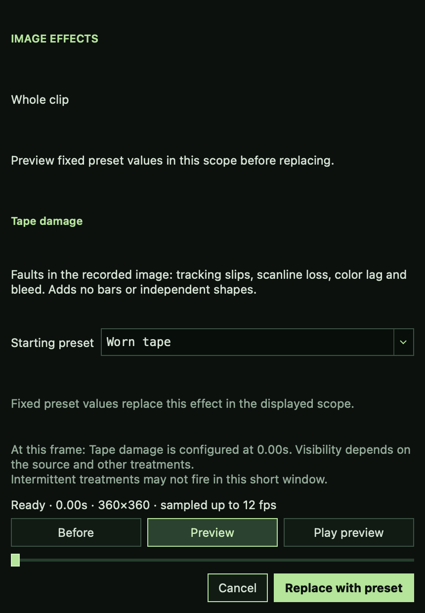
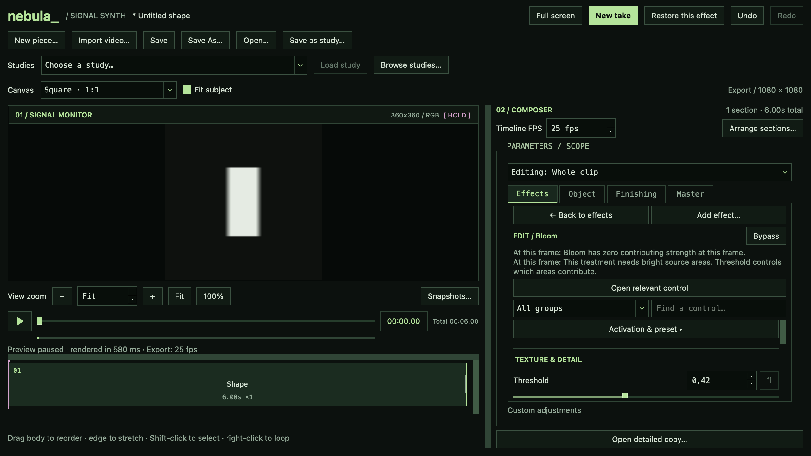
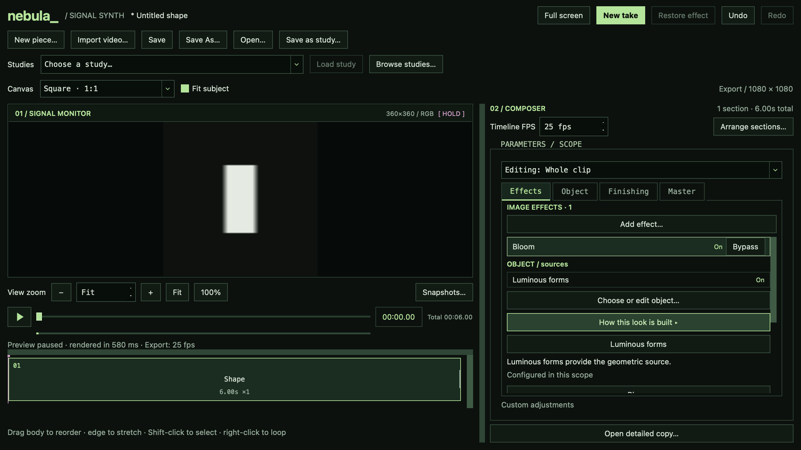

# A4 visual effect discovery delivery

Feature branch: `codex/visual-effect-discovery`, based on released 0.3.0.
Version remains 0.3.0. The installed application is unchanged.

## Delivered behavior

Effects → Add effect auditions the selected treatment and its starting preset
on the complete current composition. Before includes its existing treatments.
Selection and search/category changes debounce for 300 ms; only the selected
candidate renders. Apply commits that exact validated complete document in one
undo step. Cancel, Escape, close and contribution comparisons leave no edits.
Already authored, inherited, off and bypassed rows retain Inspect behavior.
Object-source presets keep their existing Object workflow.

Preview preset in the inspector opens the same flow, preserving bypass and
neutralizing inherited Creative adjustments under the existing replacement
rules. How this look is built derives sources and treatments from the personal
composition and selected scope, including authored off entries. It navigates to
Object/Source, effect controls, Finishing and Master. Compare without this effect
uses the established compound bypass semantics and respects section Resume.

Scope facts and exact current-frame facts are distinct. The renderer and
explanations share cue/base resolution for cuts, morphs, sweeps and flashes.
Verified zero/dependency rules cover Tape, jitter, Ghosts, halo, Bloom, phosphor
and Scan drag. Brightness is conditional guidance; no stage-input measurement or
speculative cause is presented. Identical matching Before/Preview packets can
report no visible difference without inferring why.

Auditions use a temporary 360 px longest-edge override, retain aspect/framing,
and sample original absolute frame indices at up to 12 fps over at most two
seconds of available playback scope. Section positioning is explicit, selects
the nearest real occurrence and labels its occurrence and absolute clock.
Playback waits for its bounded sampled bank; it is not guaranteed real time.
Closing restores entry position/preferences and a still-valid prior snapshot
comparison, leaving normal playback paused. Save/Export continue to use the
working document, and discovery never becomes an unsaved Creative variation.

## Native implementation adjustments

The compact browser uses an accessible list with Effect · Available/Applied
rows, keeping categories in its filter. Native macOS accessibility queries
crashed the original baseline QTableWidget browser in libqcocoa, reproduced on
the unmodified `cb36d78` browser. The compact list avoids that inherited issue.
The established standalone three-column browser remains available outside the
Studio audition flow.

macOS auditions use a floating application-modal dialog, positioned over the
inspector. Native window-modal `open()` created a sheet covering the monitor and
ignored inspector positioning. Other platforms retain window modality. Preview
transport/status/scrub and Apply/Cancel stay pinned; descriptions and the result
list scroll. No permanent column or monitor resize was introduced.

A proxy generated by the audition is allowed to appear without invalidating an
unchanged source. Source identity/stat changes still reject results and Apply.
Apply also checks the complete media context associated with the successful
candidate packet. Cached candidate reuse is conservative: changing selection
invalidates banks; Before/Preview switches reuse proven packets in that session.

`NEBULA_STATE_DIR` optionally puts development/bundle settings and logs in a
disposable directory. Normal launches keep the existing settings and log paths.
This enables built-app smoke checks without touching user preferences.

## Local measurements

Single local runs under concurrent development/test load, with a full-resolution
monitor preference, followed by a temporary 360 px audition override. The video
is a generated 720×576, 25 fps portable fixture. These are measurements, not
universal performance guarantees.

| Material | Before A4: 360 px edit → frame | Audition first frame | Next preset | Cached Before/Preview switch | Cancel callback |
| --- | ---: | ---: | ---: | ---: | ---: |
| Shape | 839 ms | 1,281 ms | 1,362 ms | 98 ms | 3.8 ms |
| Text | 497 ms | 952 ms | 900 ms | 110 ms | 5.1 ms |
| Refined signal | 4,073 ms | 4,385 ms | 7,324 ms | 131 ms | 7.3 ms |
| Generated video | 486 ms | 880 ms | 924 ms | 102 ms | 5.1 ms |

First/next timings include selection debounce and existing render debounce;
cached switches include the existing approximately 100 ms routing debounce.
The sampled timeline advanced frame 0 → 6 in 350 ms for all four materials.
The ready sample window occupied 7,776,000 frame bytes including reservations.
Peak process RSS reached 313 MiB, versus 309 MiB in the before-A4 multi-material
run. The 192 MiB limit applies to frame banks/reservations, not total process
memory or separately bounded video/mask/thumbnail caches. Four repeated close /
reopen cycles per material left no surviving audition dialog children.

## Limits

Intermittent effects may not fire in the short window. Diagnostics expose known
configuration and verified no-op conditions; they do not scan/render a full
composition to locate an active moment or measure exact stage luminance.
Source-only entry preview is suspended during auditions and restored on exit.
Subject cutout requires explicit Prepare preview before local mask preparation.
A slow study can take several seconds per new still and longer to prepare its
sampled loop. Reopening a preset starts conservatively rather than promising an
unproven cache hit. Whole-clip temporary bypass retains explicit local Resume.

A5 motion and audio reactivity remain unimplemented.

## Validation and review evidence

- Integrated plan suites plus candidate/diagnostic tests and the 12 frozen
  baseline cases: **232 passed in 988.42 s**. Frozen manifests were not changed.
- After native and lifecycle fixes, the relevant browser, discovery, diagnostics,
  A3 UI and real-editor integration suites: **59 passed in 221.55 s**.
- Latest compact browser/new UI gate, including live halo-control navigation:
  **25 passed in 3.26 s**. Current-loop failure → Retry/paused transport is covered.
- Generated-video audio export/trim/loop/hold/range checks: **6 passed in 1.52 s**.
- Version synchronization and whitespace checks pass; all metadata stays 0.3.0.
- macOS build completed without `--install`; deep/strict code-sign verification
  passed. The signed dist bundle was launched with isolated state: Add/search
  Photocopy reached Ready at 360×288 with Apply enabled; Cancel restored the
  original clean Refined signal and disabled Undo; Cmd-Q exited normally.
  Native source-app review exercised search, preset readiness, sampled
  preparation/playback, Before/Preview, Apply, breakdown, temporary bypass,
  Close, Cancel and Undo returning the original clean piece.
- Native Qt geometry/captures cover square at 1280×720, original at 1280×800,
  Stories at 1440×900, Doryphoros at 1280×720 and mixed media at 1280×800. Auditions
  are 430×620; preview dimensions are respectively 360×360, 360×288, 202×360,
  360×202 and 360×360. Apply/transport remain visible; every Cancel kept clean
  history. Full parent-window/non-overlap screenshot verification is not claimed;
  positioning is based on the actual inspector/window geometry.

Representative native Qt widget captures from disposable source-app state:

